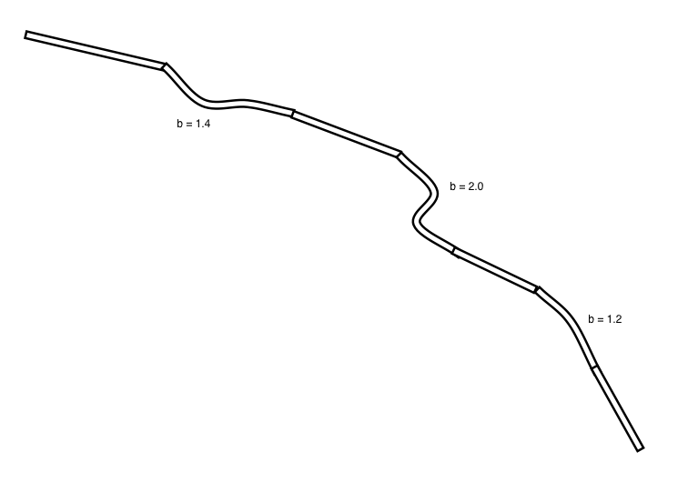

# Traffic simulation

## Description

Analyze the behavior of drivers on a new road to determine the optimal speed
limits.

## Objectives

### Learning Objectives

After completing this assignment, you should understand:

* ...

### Performance Objectives

After completing this assignment, you should be able to:

* ...

## Details

### Deliverables

* A Git repo called traffic-simulation containing at least:
  * `README.md` file explaining how to run your project
  * a `requirements.txt` file
  * a suite of tests for your project

### Requirements  

* Passing unit tests
* No PEP8 or Pyflakes warnings or errors

## Normal Mode

We have a new section of road being built and do not know what the speed limit
should be. This section of road is 7 kilometers long.

* Kilometer 1: straight.
* Kilometer 2: slight curve. 40% higher braking chance.
* Kilometer 3: straight.
* Kilometer 4: curve. 100% higher braking chance.
* Kilometer 5: straight.
* Kilometer 6: slight curve. 20% higher braking chance.
* Kilometer 7: straight.

## Hard Mode

In addition to the requirements from **Normal Mode**:

...

## Notes

...

## Additional Resources

* ...

## Credit

...

Chance of accidents = 1 km/h increase in speed = 3% increase in accidents. This is a power function.

Driver type      | Normal   | Aggressive | Commercial
-----------------|----------|------------|------------
Acceleration     | 2 m/s/s  | 5 m/s/s    | 1.5 m/s/s
Braking          | 5 m/s/s  | 10 m/s/s   | 3 m/s/s
Desired speed    | 110 km/h | 130 km/h   | 100 km/h
Vehicle size     | 5 m      | 5 m        | 25 m
Minimum spacing  | 15 m     | 10 m       | 75 m

* m = meters
* km = kilometers
* s = second
* h = hour
